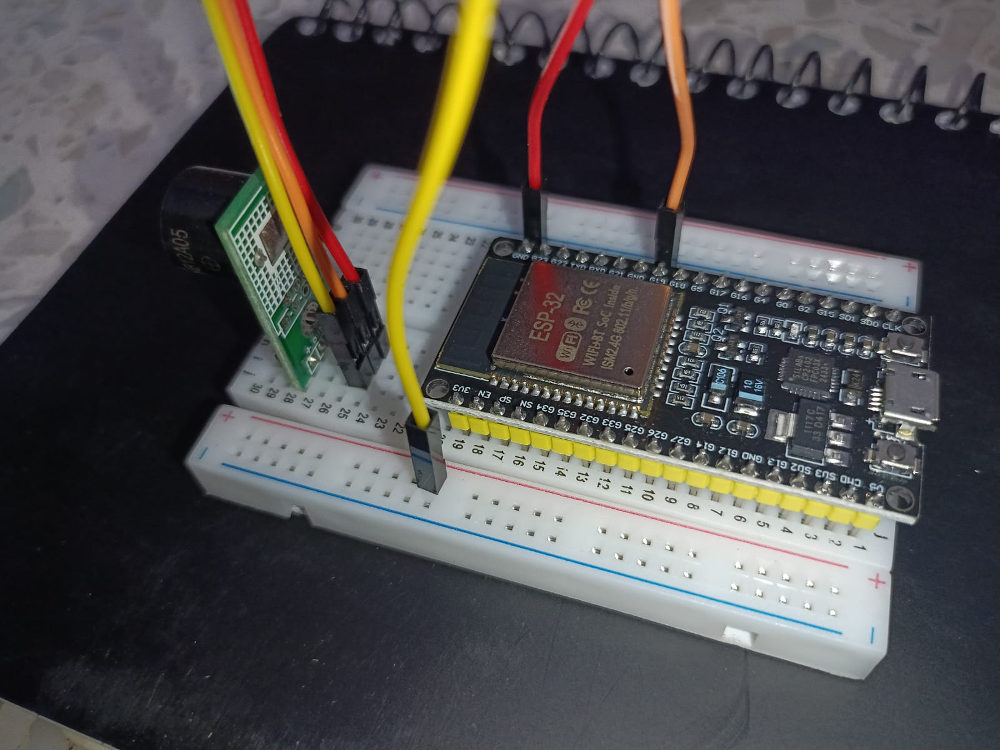

# Hawk-Eye (Smart Gateway with Wi‑Fi Monitoring using ESP32)

Hawk-Eye is a lightweight Wi‑Fi monitoring system built using the ESP32 microcontroller. 
The project focuses on tracking devices connected through an ESP32 access point and monitoring their network activity in real time.
Instead of behaving like a normal hotspot, the ESP32 acts as a small monitoring gateway that can identify devices using MAC addresses, 
detect connection events, track reconnect frequency, and observe how long a device stays connected.

The main goal of this project was to understand how Wi‑Fi device monitoring works at a practical level while 
building something that feels closer to a real-world cybersecurity and networking system.


# Features
Real-time Wi‑Fi device monitoring
Detects:
  New connections
  Disconnections
  Reconnections
  Device identification using MAC addresses
  Automatic device naming system (A1, B2, C3...)
  Friendly device recognition using predefined MAC addresses
  Connection duration tracking
  Reconnection frequency tracking
  Live active-device monitoring through Serial Monitor
  ESP32 dual-mode operation (AP + STA)


# How It Works
The ESP32 operates in two modes at the same time:
STA (Station Mode) --> connects to an existing router or mobile hotspot
AP (Access Point Mode) --> creates its own Wi‑Fi network for devices

Flow:
 
```
Internet Source / Router
          |
      ESP32 (Gateway)
          | 
 Connected Devices
```

Devices connect to the ESP32 access point instead of directly connecting to the router. 
The ESP32 then monitors all connected devices and tracks their activity.
Each device is identified using its MAC address and assigned a simple readable name like:

```
A1
B2
C3
```
The system also checks whether the device is already saved as a trusted/friendly device.


# Tech Stack Used
ESP32
Arduino Framework
Embedded C/C++
Wi‑Fi Networking Concepts
PlatformIO / Arduino IDE


# Networking Concepts Used
This project helped in understanding and implementing several networking concepts including:

Wi‑Fi Access Point (AP)
Station Mode (STA)
MAC Address Identification
IP Address Allocation
DHCP Basics
Gateway-Based Communication
Real-Time Device Tracking


# Setup image of the Hardware
Below is the hardware setup of HAWK-EYE


# Skills Applied
ESP32 Programming
Embedded Systems Development
Real-Time Logic Building
Wi‑Fi Networking
Debugging & Testing
Problem Solving
Serial Monitoring
System Integration


# Current Limitations
The ESP32 can only monitor devices connected through its own access point.
Devices connected directly to the router are not visible.
Deep packet inspection and advanced traffic analysis are not implemented.
Full router-level traffic enforcement is limited by ESP32 hardware constraints.


# Future Enhancements
Planned upgrades for the project include:
Web dashboard for live monitoring
AI-based anomaly detection
Intrusion alerts for unknown devices
Router-level gateway enforcement
Cloud logging and remote monitoring
Bluetooth-based nearby device detection
Mobile app integration


# Sample Output
```
FRIENDLY DEVICE CONNECTED: A1
Device: [Friendly] A1
MAC: XX:XX:XX:XX:XX:XX
IP: 192.168.4.2
Time: 12s
Reconnects: 1

--------------------------------

UNRECOGNIZED DEVICE CONNECTED: B2

Device: [Unknown] B2
MAC: XX:XX:XX:XX:XX:XX
IP: 192.168.4.3
Time: 4s
Reconnects: 0
```


# Learning Outcome
This project was more than just connecting an ESP32 to Wi‑Fi. 
It helped in understanding how devices behave inside a network, how gateways work, and how real-time monitoring systems can be built using low-cost hardware.

The project also improved practical knowledge in networking, embedded systems, debugging, and real-time system design.


# Author
developer : K. Likhith Bhanu
